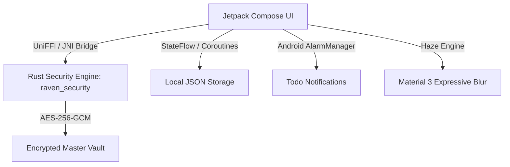

# RavenHub

  

  
  
  
  
  

---

**RavenHub** is a premium, offline-first personal productivity, secret vault, and financial analytics dashboard for Android. Powered by a high-performance **native Rust security engine** (`raven_security`), it delivers military-grade **AES-256-GCM** hardware encryption, dynamic Material 3 Expressive UI, Haze expressive blur effects, task planning with local reminders, categorized markdown notes, and complete monthly financial management—100% offline with zero cloud tracking or root requirements.

**RavenHub** は、Android向けの高性能でプライバシー重視のパーソナルプロダクティビティ、セキュレットボルト、および財務アナリティクスダッシュボードです。ネイティブの**Rustセキュリティエンジン**により、高度な暗号化と完全なオフライン管理を実現します。

---

## Core Features / 機能一覧

### 📅 Planner & Habit Tracker / タスク＆習慣管理
* **Interactive Todo List:** Easily manage daily tasks with priority tags, completion toggles, and overdue tracking.
  タスクの優先度管理と完了状態のリアルタイム切り替え。
* **Habit Frequency Monitoring:** Track recurring habits (Daily, Weekly, Monthly) with completion streaks.
* **Local Reminder Notifications:** Integrated scheduler sending precise alarms for upcoming deadlines without external server dependency.

### 📝 Notes Engine / ノート機能
* **Categorized Markdown Editor:** Rich text formatting, instant search filtering by category, and clean UI navigation.
  カテゴリ別の即時検索とマークダウンリッチエディタ。
* **Instant Privacy Lock:** Automatically secures notes behind master PIN authorization on app pause or background exit.

### 🔐 Encrypted Vault & Secrets / 暗号化ボルト
* **AES-256-GCM Hardware Crypto:** Protect sensitive passwords and confidential documents using native Rust FFI bridges.
  Rust FFIブリッジによるハードウェアレベルのAES-256-GCM暗号化。
* **Secure File Vault:** Instant open-in intent launcher for encrypted files with FileProvider integration.
* **Re-Auth Protected Actions:** Requires master PIN authentication before revealing secret credentials or exporting files.

### 💳 Finance Manager & Analytics / 財務管理＆アナリティクス
* **Dual Income & Expense Tracking:** Log income (+) and expense (-) items with tailored category tags.
* **Monthly Balance Card:** Displays monthly net surplus/deficit with color-coded primary green (`#4CAF50`) indicators.
* **Collapsible History Breakdown:** Filter transaction history month-by-month with collapsible details view.

---

## 🛠️ Technical Architecture / 技術アーキテクチャ

RavenHub is built with high security and ultra-fast UI rendering in mind, bridging Jetpack Compose directly to compiled Rust libraries.

パフォーマンスとプライバシーを最優先に設計されたアーキテクチャ。

* **Zero Cloud Dependency:** All data stored locally in app-private encrypted storage.
* **Native Rust FFI Bridge:** Hardware-accelerated AES-256 encryption via UniFFI.

---

## Installation & Build / インストールとビルド

RavenHub is built for universal compatibility on all Android devices (API 26+) with no root required.

### Supported Architectures / 対応アーキテクチャ
| Target ABI | Device Compatibility | APK Binary |
| :--- | :---: | :---: |
| **arm64-v8a** | Modern 64-bit Android Devices | `RavenHub-1.0-arm64-v8a-release.apk` |
| **armeabi-v7a** | Legacy 32-bit Devices | `RavenHub-1.0-armeabi-v7a-release.apk` |
| **x86_64** | Android Emulators / Intel Devices | `RavenHub-1.0-x86_64-release.apk` |
| **Universal** | All Compatible Devices | `RavenHub-1.0-universal-release.apk` |

---

## 🛡️ Security & Privacy / セキュリティ

* **Master Key Management:** Passwords and key materials are cached securely in memory using Conscrypt/Rust encryption.
* **Auto-Lock Lifecycle:** Automatically locks app states when sent to background or killed.

---

## Contributing & Bug Reports

We welcome contributions to make **RavenHub** even better!

* **Report Bugs:** Open an [Issue](https://github.com/xzhrael/RavenHub/issues) and attach relevant logs if you encounter any bugs.
* **Pull Requests:** Fork the repository, create a feature/bugfix branch, and submit a PR detailing your changes.

---

## 🧑‍💻 Core Developers & Credits / 開発者とクレジット

### Core Developers / 開発メンバー

| Role | Developer |
| :--- | :--- |
| **Lead Developer** | [@xzhrael](https://github.com/xzhrael) (Luca Azhrael) |

---

## Stay Updated / 最新情報

  
  

---

## 📜 License / ライセンス

This project is licensed under the **Apache License 2.0**.

> Licensed under the Apache License, Version 2.0 (the "License");
> you may not use this file except in compliance with the License.
> You may obtain a copy of the License at [http://www.apache.org/licenses/LICENSE-2.0](http://www.apache.org/licenses/LICENSE-2.0)
